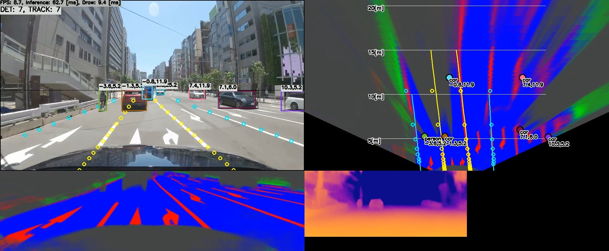

# 🚗 Self-Driving Car Vision System (Object, Lane, Depth & Top View)

This project simulates a simplified computer vision stack for autonomous vehicles. It mimics real-world self-driving demos by performing:

- 🚦 **Object Detection & Tracking**
- 🛣 **Lane Detection with Curve Fitting**
- 🛣 **Road Segmentation**
- 🧠 **Monocular Depth Estimation**
- 🔄 **View Transformation** using Projective Geometry & the Pinhole Camera Model:
  - Normal View ➝ Bird’s Eye View
  - Image Plane ➝ Ground Plane (Real-World Coordinates)

🎬 **Demo**: [Watch on YouTube](https://youtu.be/9GTWbsp4UMA)



---

## 🖥️ Tested Environment

### 💻 Computers
- **Windows 10 (x64)** with **Visual Studio 2019**
  - Intel Core i7-6700 @ 3.4GHz
  - NVIDIA GeForce GTX 1070

- **Jetson Xavier NX (JetPack 4.6)**
  - ⚠️ JetPack 4.5 and earlier not supported due to TensorRT issues

### 🧠 Inference Backend
- **TensorFlow Lite (CPU)** – very slow
- **TensorRT (GPU)** – fast and optimized

---

## 🚀 Usage

```bash
./main [input]
