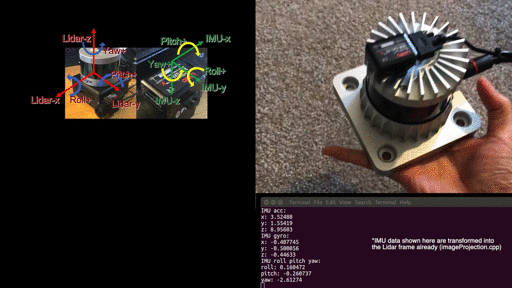

# LIO-Fusion: Real-Time LiDAR-Inertial Odometry

**LIO-Fusion** is a real-time LiDAR-Inertial Odometry system I worked on to accurately track 3D motion. It combines LiDAR point clouds and IMU data using a dual-factor graph setup to deliver reliable localization, even in complex and dynamic environments.

    

---

## 🔧 Preparing LiDAR Data (What I Did)

For LIO-Fusion to work properly, the LiDAR data needs to be formatted correctly so the system can deskew each scan using IMU data. This all happens inside `imageProjection.cpp`.

Here’s what your point cloud should include:

- **Timestamps**: Every point in the scan must have a relative timestamp (from the start of the scan). If you're using Velodyne, this usually comes out of the box in the `time` field. For other sensors, make sure the timestamp represents relative time within a scan — for a 10Hz LiDAR, it should range between 0 and 0.1 seconds.

- **Ring index**: This identifies which vertical laser channel (or ring) each point belongs to. This helps the system organize points into scan lines. Velodyne gives this automatically under `ring`. If you're using a different sensor, you might need to rename or remap this info. This currently works best with mechanical spinning LiDARs.

---

## 🧭 Preparing IMU Data 

Setting up the IMU correctly is just as critical as the LiDAR. Here’s how I configured it:

- **IMU type**: A 9-axis IMU is required — one that provides roll, pitch, and yaw. I used the Microstrain 3DM-GX5-25 (running at 500Hz). You can get by with 200Hz, but the higher the better. If you’re using a 6-axis IMU, you might want to try the [liorf fork](https://github.com/YJZLuckyBoy/liorf), which supports that setup.

- **Frame alignment**: The IMU data needs to be transformed into the LiDAR frame. This is done in your `params.yaml` file using two settings:
  - `extrinsicRot`: for rotation from IMU to LiDAR
  - `extrinsicRPY`: same thing, but expressed as roll-pitch-yaw angles

In my case, the IMU's acceleration and orientation data came from slightly different coordinate frames, so I had to negate some axis values (like X or Z). Depending on your sensor, you may need to tweak these too.

- **Debugging tip**: Uncomment the debug lines in `imuHandler()` inside `imageProjection.cpp`. Then just rotate the sensor manually and check if the orientation output makes sense. It helped me quickly verify that the IMU-to-LiDAR transformation was right.

    

    

 ## 🔧 Preparing LiDAR Data 

Before running LIO-Fusion, it’s super important to make sure your LiDAR data is in the right format so the system can deskew each scan correctly (done in `imageProjection.cpp`). Here's what you need:

- **Point timestamp**: Every point should include a relative timestamp (from the start of the scan). For Velodyne users, this usually comes out of the box as the `time` field. If you're using a different sensor, just make sure you're recording the time correctly — it should go from 0 to about 0.1 seconds for a 10Hz LiDAR.

- **Ring number**: We need this to sort the points by scan lines. Again, Velodyne handles this out of the box with the `ring` field. If you're on something else, just check how to extract this info. Right now, this only works with mechanical spinning LiDARs.

---

## 🧭 Preparing IMU Data (What Worked for Me)

- **IMU type**: You’ll need a 9-axis IMU for best results (i.e., one that gives you roll, pitch, and yaw). I used the Microstrain 3DM-GX5-25 (500Hz). 200Hz is the minimum recommended. If you’re trying with a 6-axis IMU, check out the [liorf](https://github.com/YJZLuckyBoy/liorf) fork.

- **Coordinate transformation**: Your IMU’s data must be aligned with your LiDAR frame. This means setting the correct `extrinsicRot` and `extrinsicRPY` values in `params.yaml`. These account for how your IMU is mounted (e.g., flipped, rotated, etc.).

    - For my setup, I had to negate some acceleration and gyro readings to match the ROS standard (x = forward, y = left, z = up).
    - For orientation, you’ll provide a rotation from LiDAR to IMU as `q_lb` (in roll-pitch-yaw) and LIO-Fusion will compute `q_wl = q_wb * q_bl` internally.

- **Debugging tips**: If things look weird (like unstable orientation), I highly recommend uncommenting the debug print lines inside `imuHandler()` in `imageProjection.cpp`. Then move the device around to check if orientation updates make sense.

    

    

